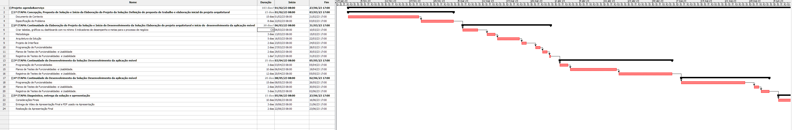
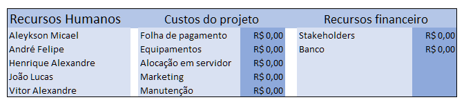

# Especificações do Projeto

A definição exata do problema e os pontos mais relevantes a serem tratados neste projeto foi consolidada com a participação dos usuários em um trabalho de imersão feita pelos membros da equipe a partir da observação dos usuários em seu local natural e por meio de entrevistas. Os detalhes levantados nesse processo foram consolidados na forma de personas e histórias de usuários.

## Personas

<table>
 <tbody>
  <tr>
   <td rowspan="3"></td>
   <td colspan="3"><strong>TULIO</strong></td>
  </tr>
  
  <tr>
   <td colspan="3">
   BARBEIRO
   </td>
  </tr>
  
  <tr>
   <td colspan="3">
    JOVEM ADULTO (19 A 25 ANOS)
   </td>
  </tr>
  
  <tr>
   <td colspan="1" align="left" valign="middle">
    <strong>Biografia:</strong>
   </td>
   <td colspan="3" align="left" valign="top">
    Túlio nasceu em 2001, cresceu bem e saudável. Enquanto concluía o ensino médio, conseguiu seu primeiro emprego como auxiliar de telhadista. Enjoado de seu trabalho e sem perspectiva de futuro na área, decidiu se profissionalizar em barbearia e abrir seu próprio negócio. Seu negócio prosperou, trabalha ao lado de diversos profissionais e hoje possuí uma agenda lotada.
   </td>
  </tr>
  
  <tr>
   <td colspan="4" align="center">
    <strong>DETALHES PESSOAIS</strong>
   </td>
  </tr>
  
  <tr>
   <td colspan="1" align="left" valign="top">
    <strong>Localização:</strong>
     
    Belo Horizonte
   </td>
   <td colspan="1" align="left" valign="top">
    <strong>Renda Familiar:</strong>
     
    De R$3.501,00 a R$6.500,00
   </td>
   <td colspan="1" align="left" valign="top">
    <strong>Nível Educacional:</strong>
     
    Ensino médio completo
   </td>
   <td colspan="1" align="left" valign="top">
    <strong>Status de Relacionamento:</strong>
     
    Solteiro
   </td>
  </tr>
  
 <tr>
   <td colspan="4" align="center">
    <strong>CARREIRA</strong>
   </td>
  </tr>
  
  <tr>
   <td colspan="1" align="left" valign="top">
    <strong>Empresa:</strong>
     
    Barber House
   </td>
   <td colspan="1" align="left" valign="top">
    <strong>Tamanho da Empresa:</strong>
     
    Pequeno porte
   </td>
   <td colspan="2" align="left" valign="top">
    <strong>Responsabilidades Profissionais:</strong>
     
    Túlio atua gerenciando a equipe de barbeiros da Barber House, onde atua também como barbeiro no local.
   </td>
  </tr>
  
  <tr>
   <td colspan="2" align="left" valign="top">
    <strong>Objetivos:</strong>
     
    Túlio almeja realizar outros tipos de empreendimentos e se tornar um empresário de sucesso.
   </td>
   <td colspan="2" align="left" valign="top">
    <strong>Desafios:</strong>
     
    Túlio atualmente atende seus clientes manualmente através de ligações e WhatsApp, o que toma muito do seu tempo e esforço que poderia ser aplicado em outros objetivos.
   </td>
  </tr>
 </tbody>
</table>
 
<table>
 <tbody>
  <tr>
   <td rowspan="3"></td>
   <td colspan="3"><strong>LUCAS</strong></td>
  </tr>
  
  <tr>
   <td colspan="3">
   PERSONAL TRAINER
   </td>
  </tr>
  
  <tr>
   <td colspan="3">
    ADULTO (26 A 40 ANOS)
   </td>
  </tr>
  
  <tr>
   <td colspan="1" align="left" valign="middle">
    <strong>Biografia:</strong>
   </td>
   <td colspan="3" align="left" valign="top">
    Lucas nasceu no ano de 1996, em Belo Horizonte/MG. Na sua adolescência, entrou pela primeira vez em uma academia, onde se apaixonou pelo esporte e decidiu que queria viver daquilo. Aos 20 anos participou de sua primeira competição de fisiculturismo, onde ganhou em 1° lugar. Aos 22 anos se formou na PUC Minas, se tornando bacharel em educação física. Hoje, Lucas possui seu próprio negócio atuando como Personal Trainer.
   </td>
  </tr>
  
  <tr>
   <td colspan="4" align="center">
    <strong>DETALHES PESSOAIS</strong>
   </td>
  </tr>
  
  <tr>
   <td colspan="1" align="left" valign="top">
    <strong>Localização:</strong>
     
    Belo Horizonte
   </td>
   <td colspan="1" align="left" valign="top">
    <strong>Renda Familiar:</strong>
     
    De R$3.501,00 a R$6.500,00
   </td>
   <td colspan="1" align="left" valign="top">
    <strong>Nível Educacional:</strong>
     
    Ensino superior completo
   </td>
   <td colspan="1" align="left" valign="top">
    <strong>Status de Relacionamento:</strong>
     
    Casado
   </td>
  </tr>
  
 <tr>
   <td colspan="4" align="center">
    <strong>CARREIRA</strong>
   </td>
  </tr>
  
  <tr>
   <td colspan="1" align="left" valign="top">
    <strong>Empresa:</strong>
     
    PersoMove
   </td>
   <td colspan="1" align="left" valign="top">
    <strong>Tamanho da Empresa:</strong>
     
    Microempresa
   </td>
   <td colspan="2" align="left" valign="top">
    <strong>Responsabilidades Profissionais:</strong>
     
    Preparar e acompanhar os seus treinos de forma a realizar os exercícios com segurança, para proporcionar um condicionamento adequado, com finalidade estética, de reabilitação, de treino ou de manutenção da saúde.
   </td>
  </tr>
  
  <tr>
   <td colspan="2" align="left" valign="top">
    <strong>Objetivos:</strong>
     
    O principal objetivo de Lucas é realizar o seu trabalho com qualidade e mudar a vida das pessoas ensinando-as a viver de modo saudável.
   </td>
   <td colspan="2" align="left" valign="top">
    <strong>Desafios:</strong>
     
   Lucas atende seus clientes em domicílio, seja na academia ou em suas residências. Porém, possuí dificuldade para manter sua agenda organizada, além de dificuldades para encontrar o cliente no local combinado.
   </td>
  </tr>
 </tbody>
</table>
 
<table>
 <tbody>
  <tr>
   <td rowspan="3"></td>
   <td colspan="3"><strong>SHEILA</strong></td>
  </tr>
  
  <tr>
   <td colspan="3">
   PEDIATRA
   </td>
  </tr>
  
  <tr>
   <td colspan="3">
    ADULTO (26 A 40 ANOS)
   </td>
  </tr>
  
  <tr>
   <td colspan="1" align="left" valign="middle">
    <strong>Biografia:</strong>
   </td>
   <td colspan="3" align="left" valign="top">
    Sheila nasceu em 1990, apesar de ter passado dificuldades em sua infância com sua saúde, cresceu bem. Em sua adolescência, passou em 3° lugar em medicina pela USP-SP, onde se formou com 25 anos. Com 30 anos, tornou-se Doutora em pediatria pela mesma universidade. Hoje, Sheila possui sua própria clínica especializada em Pediatria.
   </td>
  </tr>
  
  <tr>
   <td colspan="4" align="center">
    <strong>DETALHES PESSOAIS</strong>
   </td>
  </tr>
  
  <tr>
   <td colspan="1" align="left" valign="top">
    <strong>Localização:</strong>
     
    São Paulo
   </td>
   <td colspan="1" align="left" valign="top">
    <strong>Renda Familiar:</strong>
     
    Acima de R$10.000,00
   </td>
   <td colspan="1" align="left" valign="top">
    <strong>Nível Educacional:</strong>
     
    Ensino superior completo
   </td>
   <td colspan="1" align="left" valign="top">
    <strong>Status de Relacionamento:</strong>
     
    Noiva
   </td>
  </tr>
  
 <tr>
   <td colspan="4" align="center">
    <strong>CARREIRA</strong>
   </td>
  </tr>
  
  <tr>
   <td colspan="1" align="left" valign="top">
    <strong>Empresa:</strong>
     
    Clínica Bem-me-quer
   </td>
   <td colspan="1" align="left" valign="top">
    <strong>Tamanho da Empresa:</strong>
     
    Pequeno Porte
   </td>
   <td colspan="2" align="left" valign="top">
    <strong>Responsabilidades Profissionais:</strong>
     
    Sheila atua gerenciando sua clínica, além de realizar exames completos em recém-nascidos e crianças pequenas para verificar e registrar o estado de saúde e o desenvolvimento físico normal desses pacientes.
   </td>
  </tr>
  
  <tr>
   <td colspan="2" align="left" valign="top">
    <strong>Objetivos:</strong>
     
    O principal objetivo de Sheila é ajudar crianças e bebês a crescerem bem e saudáveis, assim como uma excelente profissional a ajudou quando pequena.
   </td>
   <td colspan="2" align="left" valign="top">
    <strong>Desafios:</strong>
     
   Sheila possui uma agenda extremamente cheia, por isso, tem dificuldades em marcar horário para arrumar o cabelo, as unhas e até mesmo para uma visita de seu Personal Trainer.
   </td>
  </tr>
 </tbody>
</table>
 

## Histórias de Usuários

Com base na análise das personas forma identificadas as seguintes histórias de usuários:

|EU COMO...          | QUERO/PRECISO ...                  |PARA ...                                |
|--------------------|------------------------------------|----------------------------------------|
|Tulio               | criar meu usuário                  | usar o aplicativo.                     |
|Tulio               | entrar no aplicativo através do meu perfil | Para verificar meus compromissos. |
|Tulio               | manter uma agenda atualizada com meu horário disponível                 | que eu possa visualizar meus compromissos do dia.     |
|Tulio               | cancelar um serviço com antecedência | que o cliente/profissional não fique esperando por um serviço que não irá ocorrer. |
|Tulio               | reagendar um serviço junto ao cliente               | me adequar a situações fora do previsto.                    |
|Sheila              | ser notificado pelo aplicativo com até 15 minutos de antecedência sobre um serviço a ser realizado | me preparar para a execução do serviço. |
|Lucas               | definir um intervalo entre os serviços para me preparar                 | a execução de um serviço antes do cliente chegar.                    |
|Lucas               | enviar uma mensagem para o cliente/profissional | manter a comunicação atualizada e evitar contratempos. |
|Lucas               | manter uma lista atualizada dos serviços que posso prestar                 | oferecer ao cliente mais possibilidades de atendimento.           |
|Lucas               | escolher onde um determinado serviço irá ocorrer (se será necessário que o cliente se desloque até o local ou se o profissional irá até a residência do cliente) | oferecer ao cliente uma comodidade maior ou oferecer mais opções de serviços.  |
|Sheila              | indicar ao profissional o local onde ele irá realizar o atendimento, caso ele seja feito fora do estabelecimento                 | que o profissional possa se orientar sobre onde o serviço vai ser realizado.                     |
|Sheila              | indicar ao profissional uma descrição de como o serviço deve ser feito                 | que o profissional possa se preparar para a execução do serviço.                     |
|Sheila              | listar e filtrar os profissionais que podem ofertar o serviço na minha residência                  | para selecionar o profissional que se adapte a minha demanda.                     |
|Sheila              | incluir o endereço onde o serviço será realizado                 | o profissional possa se programar melhor para o atendimento.             |
|Lucas               | abrir o endereço onde o serviço será realizado em um aplicativo de mapa         | me programar e garantir que o serviço irá ocorrer dentro do previsto                     |
|Sheila              | visualizar os horários disponíveis na agenda do profissional              | que eu mesma possa agendar em um horário disponível para ambas as partes                     |
|Tulio               | declarar quais dias e horários um determinado serviço poderá ficar disponível para agendamento                 | que minha agenda fique flexível para folgas, férias e imprevistos                     |
|Sheila              | visualizar todos os serviços que agendei e que ainda não foram executados                   | que eu possa ver de forma simples os meus compromissos                     |

## Modelagem do Processo de Negócio 

### Análise da Situação Atual

Atualmente, o agendamento de serviços como barbeiro e cabeleireiro são feitos de forma manual. Geralmente o cliente entra em contato com o profissional, através de ligação ou mensagem de texto, o profissional muitas vezes interrompe o seu trabalho para verificar sua agenda e marcar o horário do novo cliente. Porém, esse método não é eficiente e gasta muito tempo. Uma maneira convencional de contornar essa situação seria contratar uma secretária, mas a maioria dos pequenos prestadores de serviços não tem condições para isso.

### Descrição Geral da Proposta

A principal proposta desse projeto é automatizar esse processo de agendamento de serviço. O profissional cria sua conta no aplicativo, configura seu perfil com o horário de funcionamento, realiza o cadastro dos serviços que realiza, bem como os valores dos mesmos. Após isso, todo o processo de verificar a disponibilidade de horários é feito de forma automatizada pelo aplicativo. O próprio cliente verifica os horários disponíveis e realiza o agendamento conforme suas necessidades.

### Processo 1 – Agendar serviço

O cliente de forma autônoma, sem necessidade de contatar o profissional, realiza o seu agendamento, economizando tempo de ambas as partes.

### Processo 2 –  Cliente alterar o serviço

O cliente de forma autônoma, sem necessidade de contatar o profissional, realiza o reagendamento ou cancelamento do serviço com antecedência.

### Processo 3 –  Profissional alterar o serviço

O profissional entra em contato com o cliente através do chat para negociar o reagendamento ou cancelamento do serviço. Caso o cliente não responda ao chat, o profissional pode contatar o cliente através dos métodos convencionais.

## Indicadores de Desempenho

<table>
 <tr>
  <td align="center"><strong>Indicador</strong></td>
  <td align="center"><strong>Objetivos</strong></td>
  <td align="center"><strong>Descrição</strong></td>
  <td align="center"><strong>Cálculo</strong></td>
  <td align="center"><strong>Fonte dados</strong></td>
  <td align="center"><strong>Perspectiva</strong></td>
 </tr>
 
 <tr>
  <td>Percentual de cancelamento de serviços</td>
  <td>Analisar a taxa de desistências e cancelamentos </td>
  <td>Mede a porcentagem de serviços cancelados nos últimos 30 dias</td>
  <td>SC / SA * 100, onde:
    
SA= Quantidade total de serviços agendados
    
SC= Quantidade total de serviços cancelados 
</td>
  <td>-Banco de dados (tabela de agendamentos)</td>
  <td>Clientes e demandas</td>
 </tr>
 
 <tr>
  <td>Número de serviços agendados </td>
  <td>Analisar a demanda nos últimos 30 dias </td>
  <td>Número de serviços agendados dentro do período de um mês</td>
  <td></td>
  <td>-Banco de dados (tabela de agendamentos)</td>
  <td>Clientes e demandas</td>
 </tr>
 
 <tr>
  <td>Percentual de avaliações positivas</td>
<td>Avaliar quantitativamente as avaliações positivas</td>
<td>Percentual de avaliações positivas em relação ao total de avaliações</td>
<td> P / A * 100, onde:
  
A= Quantidade total de avaliações
  
P= Quantidade de avaliações com 4 estrelas ou mais
 </td>
<td>Banco de dados (tabela de avaliações)</td>
<td>Aprendizado e crescimento</td>
 </tr>
 
 <tr>
 <td>Percentual de reclamações</td>
 <td>Avaliar quantitativamente as reclamações</td>
<td>Percentual de reclamações em relação ao total de avaliações</td>
<td> 
 R / A * 100, onde:
  
A= Quantidade total de avaliações
  
R= Quantidade de de avaliações com 3 estrelas ou menos
 </td>
<td>Banco de dados (tabela de avaliações)</td>
<td>Aprendizado e crescimento</td>
 </tr>
 
 <tr>
 <td>Percentual de agendamento dos tipos de serviço</td>
<td>Analisar os tipos de serviços mais populares</td>
<td>Número de agendamentos de determinado serviço em relação ao total de agendamentos</td>
<td>
 S / SA * 100, onde:
  
SA= Quantidade total de serviços agendados
  
S= Quantidade total de agendamentos do serviço
 </td>
<td>Banco de dados (tabela de agendamentos)</td>
<td>Clientes e demandas</td>
 </tr>
 
 </table>

## Requisitos

As tabelas que se seguem apresentam os requisitos funcionais e não funcionais que detalham o escopo do projeto. Para determinar a prioridade de requisitos, aplicar uma técnica de priorização de requisitos e detalhar como a técnica foi aplicada.

### Requisitos Funcionais

|ID    | Descrição do Requisito  | Prioridade |
|------|-----------------------------------------|----|
|RF-001| Permitir que o usuário crie uma conta (empresa ou cliente) | ALTA | 
|RF-002| Permitir que o usuário realize login   | ALTA |
|RF-003| Permitir que o usuário visualize sua agenda com compromissos marcados atualizada   | ALTA |
|RF-004| Permitir que o usuário do tipo empresa reagende um serviço junto ao usuário do tipo cliente   | ALTA |
|RF-005| Permitir que qualquer usuário cancele um serviço que ele proprio agendou ou ira realizar   | ALTA |
|RF-006| Notificar todos os tipos de usuário sobre um serviço marcado | BAIXA |
|RF-007| Permitir que usuários do tipo cliente e empresa troquem mensagens entre si   | BAIXA |
|RF-008| Permitir que usuários do tipo empresa defina um intervalo entre os serviços   | ALTA |
|RF-009| Permitir que usuários do tipo empresa crie/edite/exclua serviços.   | ALTA |
|RF-010| Permitir que usuários do tipo empresa defina onde um serviço pode ser realizado (local ou/e em domicílio)   | ALTA |
|RF-011| Permitir que usuários do tipo cliente defina o local onde o serviço será realizado se o serviço assim permitir.  | ALTA |
|RF-012| Permitir que o usuário do tipo cliente deixe um recado ao marcar um serviço  | BAIXA |
|RF-013| Permitir ao usuário do tipo cliente pesquisar por serviços, podendo filtrá-los por tipo, nome da empresa ou profissional e local do serviço   | ALTA |
|RF-014| Permitir que todos os tipos de usuário sejam redirecionados para um aplicativo de mapa, contendo o local do serviço | BAIXA | 
|RF-015| Permitir que o usuário do tipo cliente, visualize em forma de lista, todos os serviços agendados por ele, que ainda não foi executado, independente do profissional que irá realizá-lo   | MÉDIA |
|RF-016| Permitir ao usuário do tipo cliente, visualizar os horários disponíveis na agenda do profissional para determinado serviço  | ALTA |
|RF-017| Permitir ao usuário do tipo cliente, agendar de forma independente, um serviço na agenda do profissional se o horário estiver disponível   | ALTA |
|RF-018| Permitir ao usuário do tipo empresa, declarar quais dias e horários um determinado serviço poderá ficar disponível para agendamento   | ALTA |

### Requisitos não Funcionais

|ID     | Descrição do Requisito  |Prioridade |
|-------|-------------------------|----|
|RNF-001| O aplicativo deverá ser responsivo permitindo a visualização em um celular de forma adequada | MÉDIA | 
|RNF-002| O aplicativo deve ter bom nível de contraste entre os elementos da tela em conformidade |  MÉDIA | 
|RNF-003| O aplicativo deve apresentar as informações de forma visual e acessível, através de uma interface simples |  MÉDIA | 
|RNF-004| O aplicativo deve estar disponível para acesso a qualquer horário do dia |  MÉDIA | 
|RNF-005| O aplicativo deve responder às ações do usuário de forma rápida |  MÉDIA | 
|RNF-006| O aplicativo deve impossibilitar que as senhas dos usuários sejam visíveis a atores maliciosos |  MÉDIA |
|RNF-007| As notificações de serviços agendados devem ser enviadas com no mínimo 15 minutos de antecedência |  BAIXA | 

## Restrições

O projeto está restrito pelos itens apresentados na tabela a seguir.

|ID| Restrição                                             |
|--|-------------------------------------------------------|
|01| O projeto deverá ser entregue até o final do semestre |
|02| A equipe não pode subcontratar o desenvolvimento do trabalho |
|03| O projeto deve usar um único banco de dados |

## Diagrama de Casos de Uso

# Matriz de Rastreabilidade

A matriz de rastreabilidade é uma ferramenta usada para facilitar a visualização dos relacionamento entre requisitos e outros artefatos ou objetos, permitindo a rastreabilidade entre os requisitos e os objetivos de negócio. 

## Planejamento de Cronograma

## Custos e Pessoal do Projeto

