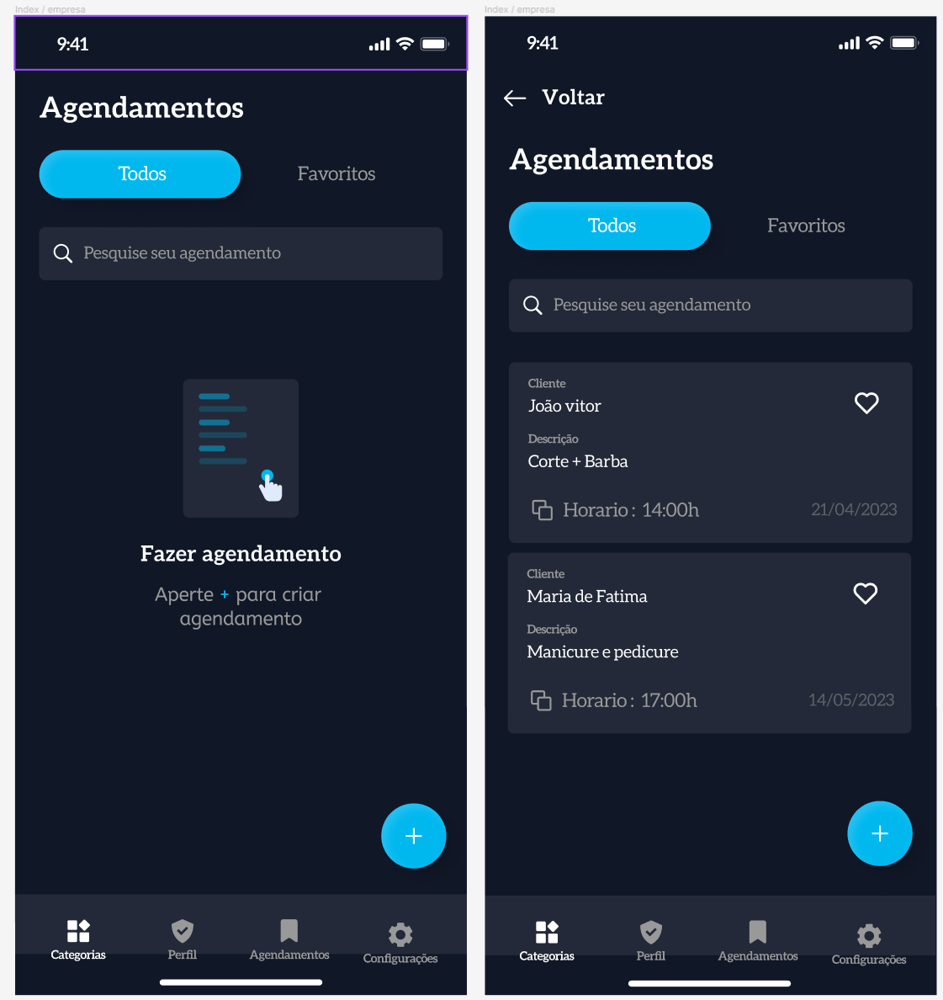
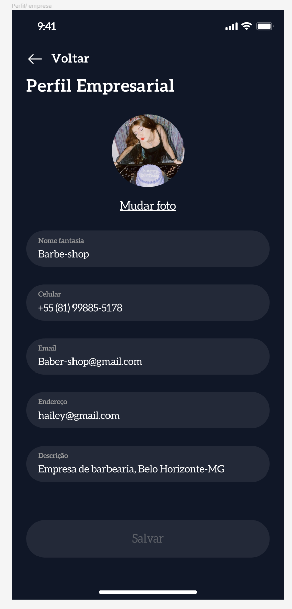

# Template Padrão da Aplicação

<h2>Login: Cliente e Empresa</h2>

<h2>Index: Cliente</h2>

<h2>Pesquisa / Perfil / Configurações: Cliente e Empresa</h2>

<h2>Index: Empresa</h2>

<h2>Perfil: Empresa</h2>

