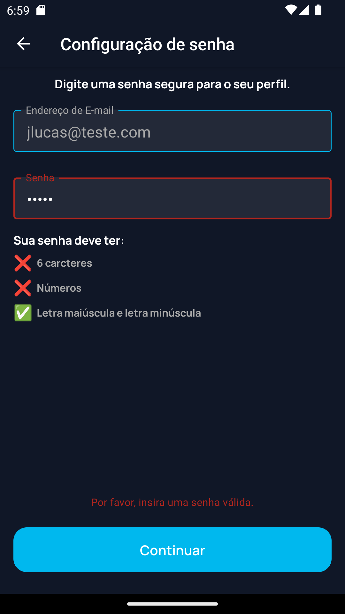
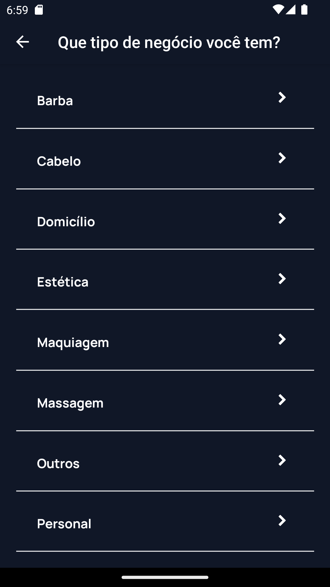
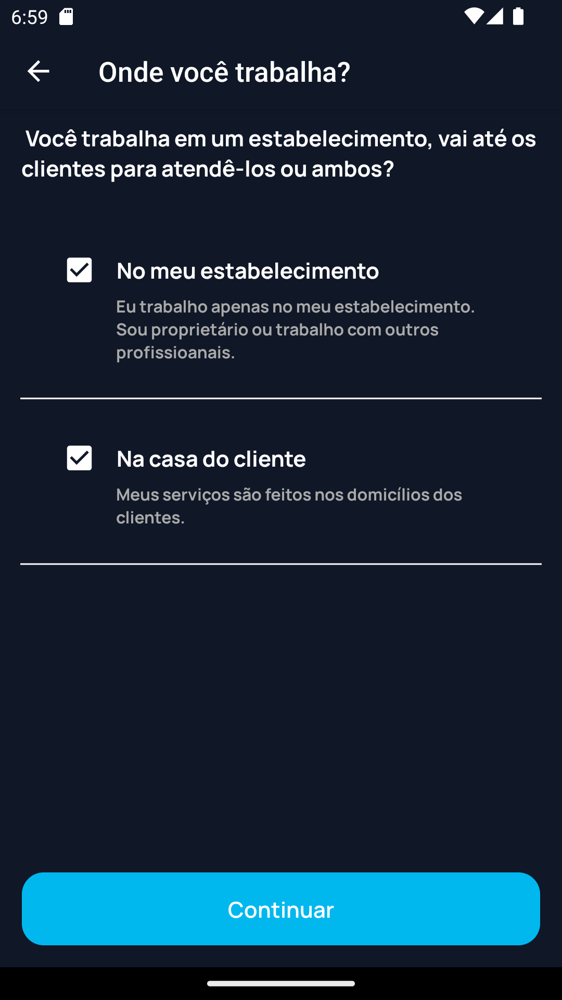
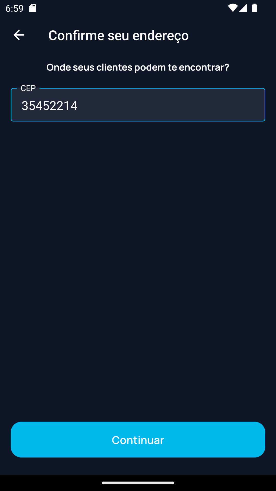
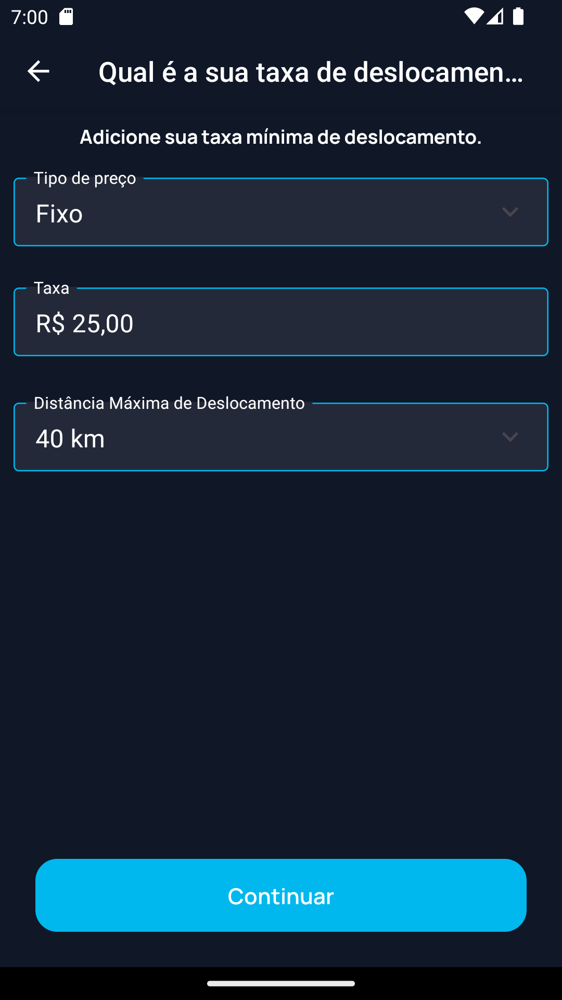
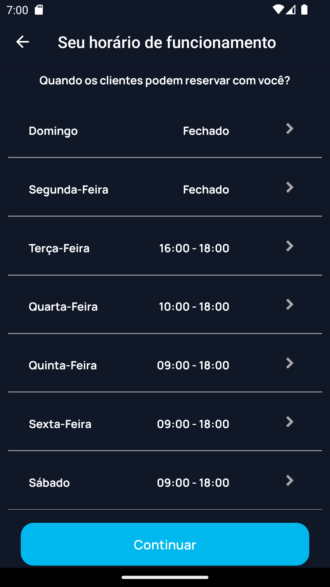
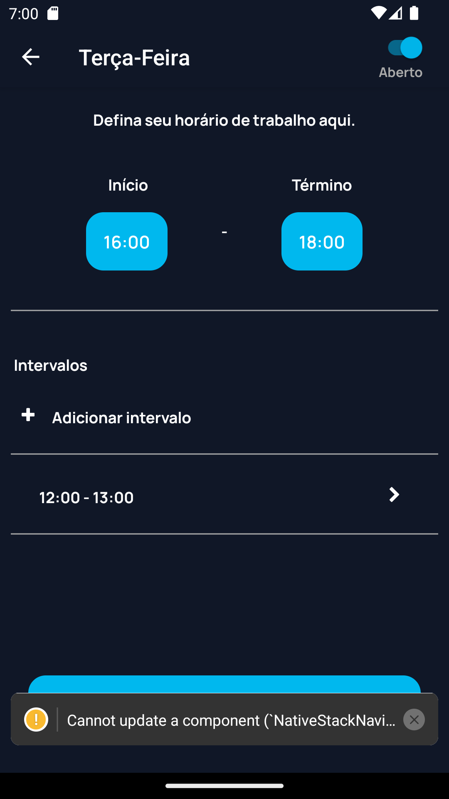
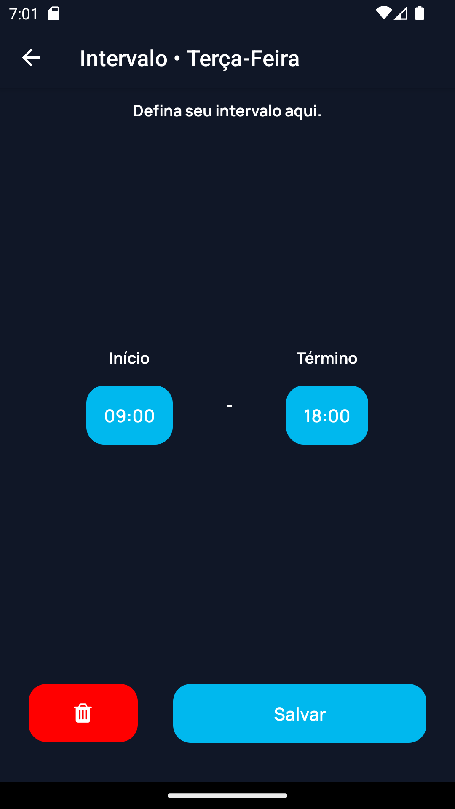
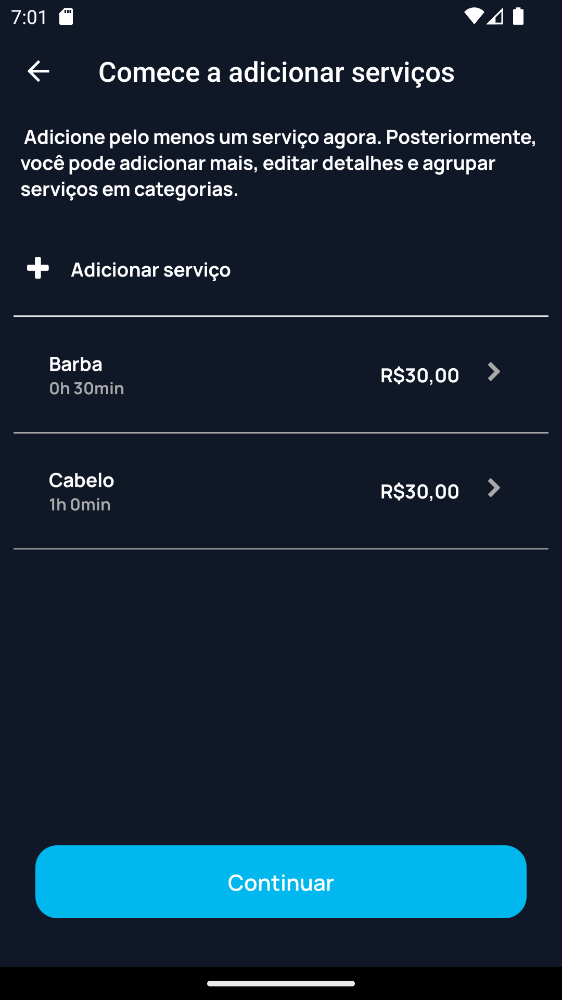

# Programação de Funcionalidades

Pré-requisitos: <a href="2-Especificação do Projeto.md"> Especificação do Projeto</a>, <a href="3-Projeto de Interface.md"> Projeto de Interface</a>, <a href="4-Metodologia.md"> Metodologia</a>, <a href="3-Projeto de Interface.md"> Projeto de Interface</a>, <a href="5-Arquitetura da Solução.md"> Arquitetura da Solução</a>

## RF-001 - Permitir que o usuário realize seu cadastro (Em desenvolvimento)
Segue a implementação das telas que registram o usuário. Cada tela tem o objetivo de captar as informações mínimas para que um usuário comece a usar o sistema.

### Tela "WhatsEmail" (Em desenvolvimento)
O usuário digita o email que deseja cadastrar. É realizado uma busca no banco de dados para verificar se o email não pertence a alguma conta, se o email ja estiver em uso, o usuário é levado de volta para a tela de login, senão é dado continuidade no processo de registro.

 

### Tela "WhoYou" 
A partir da tela “WhoYou” cria-se uma bifurcação onde o usuário define seu tipo de conta (empresarial ou cliente).

 

### Registro de usuários do tipo empresarial

#### Tela "AboutYou" 
Tela responsável por captar informações básicas do usuário: Nome e sobrenome, nome da empresa, telefone para contato.

 

#### Tela "Password" 
Tela responsável pela criação da senha da nova conta.

 

#### Tela "Category" 
Tela responsável por captar o nicho de trabalho do usuário. Essa informação será usada porteriormente para que o cliente o encontre mais facilmente.

 

#### Tela "WhereWork" 
Tela responsável por captar onde o usuário realiza seus serviços: no seu estabelecimento ou na casa do cliente. Essa informação será usada posteriormente para a configuração do endereço do usuário bem como para a criação dos seus serviços.

 

#### Telas de cadastro de endereço (ConfigCEP e ConfigAddress) 
Telas responsáveis por captar o endereço do estabelecimento do usuário. Essa informação será usada posteriormente para marcar o local do serviço.

 

 

#### Tela "DisplacementFee" 
Tela responsável por captar as informações de custo referente a deslocação do usuário para o local de execução do serviço.

 

#### Telas de cadastro de horários (ConfigOpening, ConfigDay e ConfigInterval) 
Telas responsáveis por captar informações referentes ao horário de trabalho do usuário. Essas informações serão usadas porteriromente para que o cliente possa marcar um serviço.

 

 

 

#### Telas de cadastro de serviços (ConfigServices e ServiceDetails) 
Telas responsáveis por captar informações referentes ao serviços fornecidos pelo usuário: Nome do serviço, preço, tempo de execução.

## RF-002 - Permitir que o usuário realize login

Segue a implementação da tela de login onde o usuário do sistema pode se conectar ao app e iniciar o fluxo de uso. O login do usuário pode ser feito de três formas distintas, por conta do app, login do google e login pela conta do facebook. O código escrito em typescript/javascript correspondente a esta tela se encontra no diretorio do código fonte srd/pages/login.tsx.

## Quadro Visual Atual de Gestão de Trabalho

## Status Atual das Contribuições dos Membros do Time

## Comentários Adicionais sobre as Participações Individuais

Sobre esta etapa todos os membros contribuiram de forma ativa, com excessão do integrante André Felipe Gomes. O mesmo afirmou no grupo do projeto que estava em viagem e por isso não participou. 
