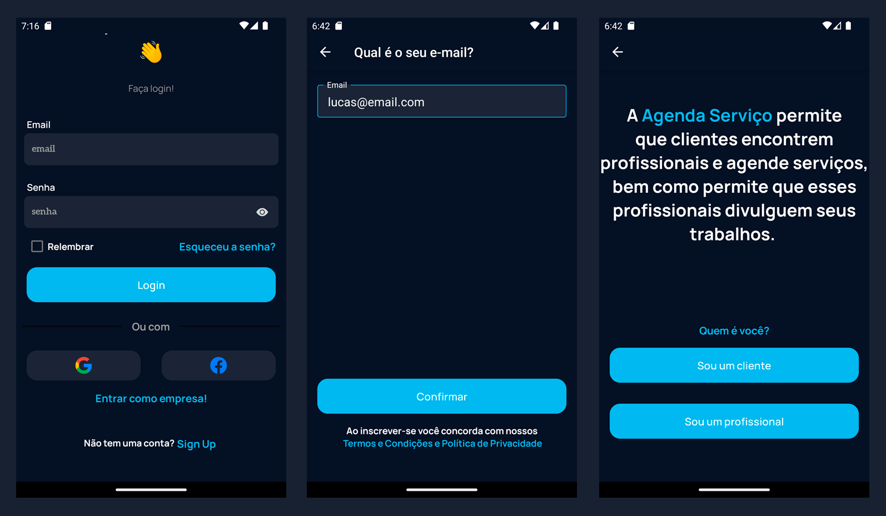
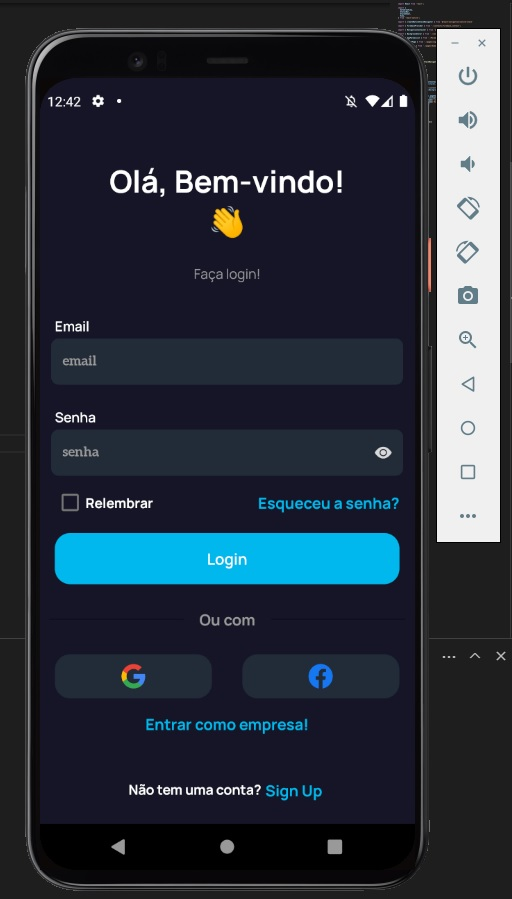
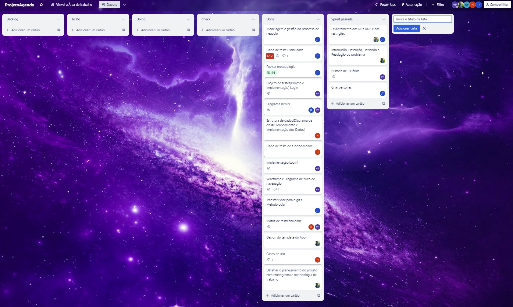
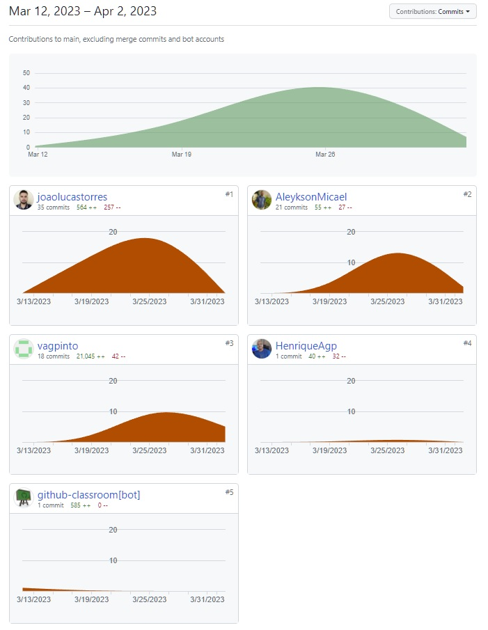

# Programação de Funcionalidades

Pré-requisitos: <a href="2-Especificação do Projeto.md"> Especificação do Projeto</a>, <a href="3-Projeto de Interface.md"> Projeto de Interface</a>, <a href="4-Metodologia.md"> Metodologia</a>, <a href="3-Projeto de Interface.md"> Projeto de Interface</a>, <a href="5-Arquitetura da Solução.md"> Arquitetura da Solução</a>

## RF-001 - Permitir que o usuário realize seu cadastro 
Segue a implementação das telas que registram o usuário. Cada tela tem o objetivo de captar as informações mínimas para que um usuário comece a usar o sistema. Na tela "Quem é você?" o usuário é qustionado se é um cliente ou profissional, a partir desse momento as telas que virão serão personalizadas para o cadastro de cada tipo de usuário.

- `RF-001 - Tela "Qual é o seu e-mail?"`: responsável por verficar se e-mail digitado pelo usuário já está cadastrado.
- `RF-001 - Tela "Quem é você"`:  responsável por cadastrar o tipo do usuário, a partir desse momento as telas que virão serão personalizadas para cada tipo de usuário.

### Registro de usuário do tipo profissional

- `RF-001 - Tela "Sobre você"`: responsável por captar informações básicas do usuário: Nome e sobrenome, nome da empresa, telefone para contato. 
- `RF-001 - Tela "Configuração de senha" `:  responsável por cadastrar a senha do novo usuário.
- `RF-010 - Tela "Onde você trabalha?" `:  responsável por captar onde o usuário realiza seus serviços: no seu estabelecimento, na casa do cliente ou em ambos.
- `RF-001 - Telas "Confirme seu endereço" `:  responsáveis por cadastrar o endereço do usuário. Caso somente a opção "Na casa do cliente" da tela "Onde você trabalha?" for marcada, o usuário poderá escolher se deseja que seu endereço seja privado.
- `RF-001 - Tela "Diga sua taxa de deslocamento" `:  essa tela ficará disponível para o usuário somente se a opção "Na casa do cliente" da tela "Onde você trabalha?" for marcada. Resposável por cadastrar os valores de deslocamento do profissional até o local do serviço.
- `RF-018 e RF-008 - Telas "Seu horário de funcionamento", "Dia(Sábado)" e "Intervalo • (Dia)"`: responsáveis por captar informações referentes ao horário de trabalho do usuário.
- `RF-009 - Telas "Começe a adicionar serviços" e "Detalhes do serviço" `: responsáveis por cadastrar os serviços que o usuário realiza bem como a categoria de cada um.

## RF-002 - Permitir que o usuário realize login

Segue a implementação da tela de login onde o usuário do sistema pode se conectar ao app e iniciar o fluxo de uso. O login do usuário pode ser feito de três formas distintas, por conta do app, login do google e login pela conta do facebook. O código escrito em typescript/javascript correspondente a esta tela se encontra no diretorio do código fonte srd/pages/login.tsx.

## Quadro Visual Atual de Gestão de Trabalho

## Status Atual das Contribuições dos Membros do Time

## Comentários Adicionais sobre as Participações Individuais

Sobre esta etapa todos os membros contribuiram de forma ativa, com excessão do integrante André Felipe Gomes. O mesmo afirmou no grupo do projeto que estava em viagem e por isso não participou. 
