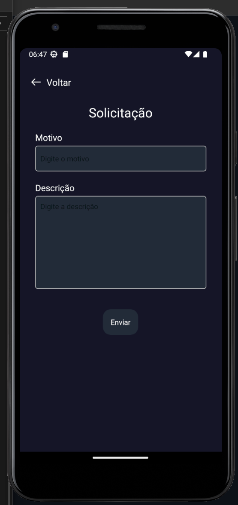
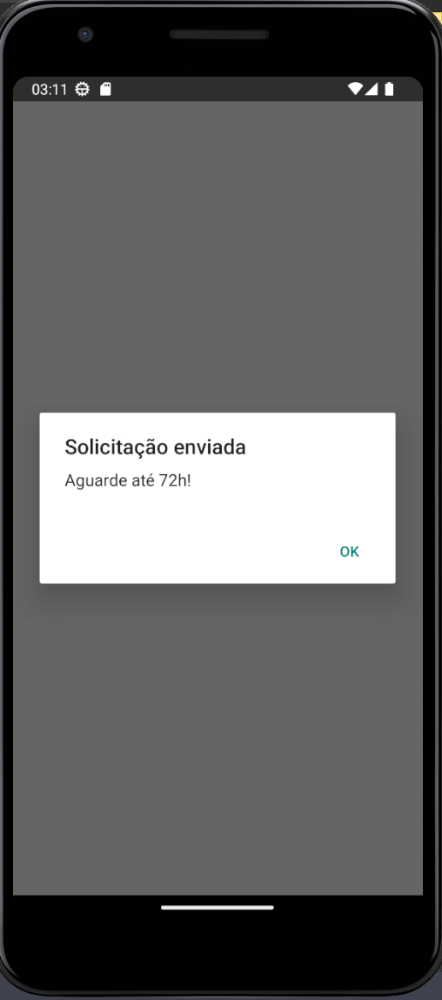

# Registro de Testes de Software

Pré-requisitos: <a href="3-Projeto de Interface.md"> Projeto de Interface</a>, <a href="8-Plano de Testes de Software.md"> Plano de Testes de Software</a>

Relatório com as evidências dos testes de software realizados no sistema pela equipe, baseado em um plano de testes pré-definido.

## Avaliação

### RF-002 - Permitir que o usuário realize login

O teste consiste em verificar se o usuário pode fazer login no sistema de diferentes formas:

- Por registro no app.
- Pela conta do google.
- Pela conta do facebook.

Primariamente o app deve ser aberto na tela de login:

Devemos prencher o usuário e senha respectivamente com as seguintes informações de teste, como demonstrado na imagem: usuario@gmail.com e 123456.

Apos pressionar o botão login, o usuário será redirecionado para a tela principal de testes.

Agora iremos realizar o teste login pela conta no google, primeiramente o botão do google deve ser pressionado:

Apos confirmar a senha, o usuário será redirecionado para a tela principal de testes:

E por fim iremos realizar o teste login pela conta no facebook, primeiramente o botão do facebook deve ser pressionado:

Apos confirmar a senha, o usuário será redirecionado para a tela principal de testes:

### RF-003 - Permitir que o usuário visualize sua agenda com compromissos marcados atualizada

O teste consiste em verificar na pagina principal se o usuário pode visualizar seus serviçõs agendados:

Conforme podemos perceber na imagem abaixo, os serviços agendados foram exibidos corretamente:

### RF-005 - Permitir que qualquer usuário cancele um serviço que ele proprio agendou ou ira realizar

O teste consiste em verificar se é possivel cancelar um serviço agendado:

Conforme podemos perceber na imagem abaixo, o serviço esta devidamente agendado:

Apos clicar no icone correspondente ao cancelamento, é possivel verificar que o sistema exibe uma mensagem de confirmação:

Apos a confirmação é possivel verificar que o serviço já esta cancelado:

### RF-006 - Notificar todos os tipos de usuário sobre um serviço marcado

O teste consiste em verificar se o usuário é notificado apos fazer um agendamentot:

Conforme podemos perceber na imagem abaixo, um agendamento está sendo realizado:

Após a confirmação é possivel ver a notificação:

### RF-009 - Exibir o perfil do usuário e alterar informações.

O teste consiste em verificar se o sistema vai recuperar as informações do usuário no banco de dados e disponibiliza-las na interface de forma satisfatoria.

- O usuário deve estar logado para realização do teste.
- O usuário deve clicar no link de redirecionamento para acessar a página de perfil.
- As informações exceto o e-mail poderão ser alteradas através da página de perfil clicando no botão de salvar informações. 
- O usuário poderá trocar sua senha pelo aplicativo
- O usuário poderá enviar mensagem de suporte

O sistema deve apresentar as informações de perfil de forma clara para o usuário cliente:

O sistema deve apresentar as informações de perfil do usuário profissional:

O sistema deve apresentar as função de trocar senha do usuário:

O sistema deve ter local para pedir suporte com o aplicatio:

